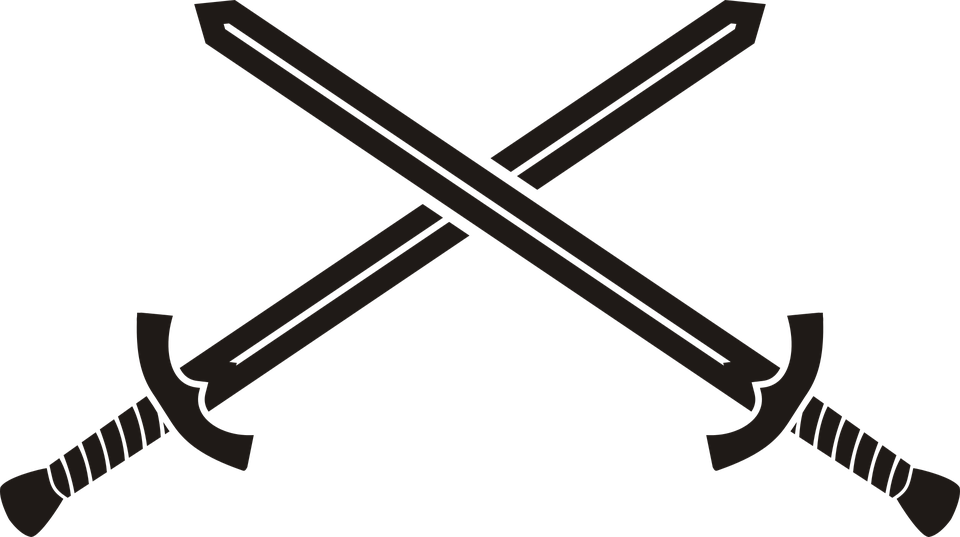

    

 
<b>
<h1 align="center">Sword Game</h1>

Simple game in HTML, CSS and pure JS. Your character has to avoid obstacles - swords.
To play this game all you have to do is download the repo and open HTML file in Chrome.

